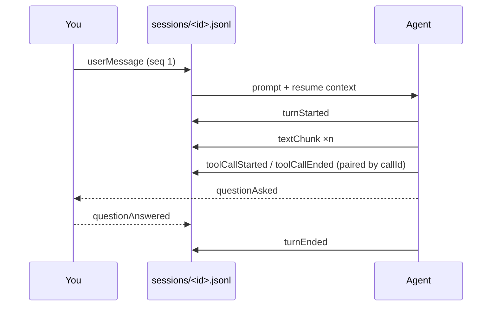

A session log is a JSONL file at `~/.pix/sessions/<sessionId>.jsonl`. It is
append-only, sequenced, and the authoritative record of the session.

## Three line types

### 1. The metadata line

Always first, exactly once:

```json
{"meta": true, "sessionId": "86c9e287-3703-4056-8c89-765ec19070d8",
 "agentId": "claude", "createdAt": 1789305378885, "workspaceKind": "project",
 "source": "claude", "nativeId": "37d49179-8f1c-4b99-9155-616685b114da",
 "projectDir": "/Users/you/repos/meadowkind"}
```

`source` is the useful field. `"pix"` means the session was started here;
an agent name means it was [imported](/under-the-hood/native-history-import)
from that agent's own history, and `nativeId` links back to the original.

### 2. Event lines

The bulk of the file. Each carries a monotonic `seq`, a timestamp, the event,
and any [blob references](/under-the-hood/blobs):

```json
{"seq": 1, "ts": 1788901791666,
 "event": {"kind": "userMessage", "text": "attach", "internal": false,
           "sessionReferences": [], "fileMentions": []},
 "payloadRefs": []}
```

### 3. Control records

Out-of-band records, identified by a `record` field instead of `event`:

```json
{"record": "sessionPayloadBlobs", "ts": 1788901803548, "version": 1}
{"record": "sessionNativeBound", "ts": 1789444019749, "nativeId": "0271c291-…"}
```

`sessionNativeBound` is written when a Pix-started session is bound to the
agent's own native session id — the moment the two identities are joined.

## Event vocabulary



Every agent's output is normalised into this vocabulary. It is what makes
handoffs possible.

| Kind | Meaning |
| --- | --- |
| `userMessage` | Your prompt, with `sessionReferences` and `fileMentions` |
| `turnStarted` / `turnEnded` | Turn boundaries — the branch points |
| `textChunk` | A piece of the agent's response, streamed |
| `toolCallStarted` | Tool invoked: `callId`, `name`, `argLine`, `args` |
| `toolCallEnded` | Result: `callId`, `status`, `output` |
| `questionAsked` / `questionAnswered` | Structured question and your answer |
| `backgroundTaskStarted` / `backgroundTaskEnded` | Long-running work |
| `agentError` | Failure, with a structured `issue` |

### Tool calls

Started and ended events are paired by `callId`:

```json
{"seq": 4, "ts": 1788901798676, "event": {
  "kind": "toolCallStarted", "callId": "toolu_012m8hQRKNFQDVn7cMu865a3",
  "name": "Bash",
  "argLine": "grep -rn \"attach\" justfile scripts/ .claude/ | head -40",
  "args": {"command": "…", "description": "Search for 'attach' in loop harness files"},
  "contextCompaction": false, "contextCompactionData": null}}
```

`argLine` is a display-ready one-liner; `args` is the structured original.
`contextCompaction` flags a call that occurred as part of compacting context,
which is how you find where a session lost detail.

The ending event carries the status and output — and failures are kept:

```json
{"seq": 5, "event": {"kind": "toolCallEnded",
 "callId": "toolu_012m8hQRKNFQDVn7cMu865a3", "status": "error",
 "output": "Use `ag` rather than `grep` to search this tree. …"}}
```

### Questions

Questions and answers are structured, keyed by `callId`, so the exchange is
recoverable rather than buried in prose:

```json
{"event": {"kind": "questionAsked", "callId": "toolu_01NZ…",
  "questions": [{"question": "Another Claude session is writing to this same working tree…",
                 "header": "Concurrent session"}]}}
{"event": {"kind": "questionAnswered", "callId": "toolu_01NZ…",
  "answers": {"Another Claude session is writing to this same working tree…": "Proceed anyway"}}}
```

### Errors

Classified, not just stringified:

```json
{"event": {"kind": "agentError",
  "message": "claude: server_error\nAPI Error: Your computer went to sleep mid-response.",
  "usage": null,
  "issue": {"category": "service", "sourceCode": "server_error",
            "retryable": true, "actions": []}}}
```

## Design properties

**Append-only.** Nothing is rewritten. A crash costs the in-flight write, not
the file.

**Sequenced.** `seq` is monotonic, so readers resume from a known position — see
[checkpoints](/under-the-hood/snapshots-and-projections#checkpoints).

**Self-describing.** Line one carries everything needed to interpret the rest.

**Bounded line size.** Large payloads are spilled to
[blobs](/under-the-hood/blobs), so lines stay parseable and the file stays
scannable.

## Reading one yourself

```bash
# Metadata
head -1 ~/.pix/sessions/<uuid>.jsonl | python3 -m json.tool

# Event histogram
python3 -c "
import json, sys, collections
c = collections.Counter()
for line in open(sys.argv[1]):
    d = json.loads(line)
    if 'event' in d: c[d['event']['kind']] += 1
    elif 'record' in d: c['record:' + d['record']] += 1
for kind, n in c.most_common(): print(f'{n:6d}  {kind}')
" ~/.pix/sessions/<uuid>.jsonl

# Every command the agent ran
python3 -c "
import json, sys
for line in open(sys.argv[1]):
    d = json.loads(line)
    ev = d.get('event', {})
    if ev.get('kind') == 'toolCallStarted' and ev.get('name') == 'Bash':
        print(ev['argLine'])
" ~/.pix/sessions/<uuid>.jsonl
```

That last one is a genuinely useful audit: every shell command an agent ran in a
session, in order.
